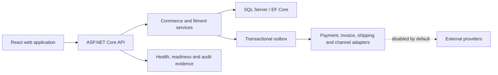

# FitmentOps

**Fitment-aware automotive commerce and operations platform**

[](https://github.com/armanvibecoding/FitmentOps/actions/workflows/ci.yml)
[](https://github.com/armanvibecoding/FitmentOps/actions/workflows/codeql.yml)
[](https://dotnet.microsoft.com/)
[](https://react.dev/)
[](LICENSE)

[Türkçe dokümantasyon](docs/README.tr.md)

FitmentOps combines vehicle-fitment evidence, catalog discovery, transactional checkout, payment and refund state, fulfillment, returns, B2B pricing, supplier sourcing, and operational administration in one automotive aftermarket platform.

> [!IMPORTANT]
> FitmentOps is an engineering preview, not a certified production storefront. Payment, electronic-document, shipping, and marketplace adapters remain fail-closed until a real provider is implemented, configured, legally reviewed, and certified in its sandbox environment.

## Why FitmentOps

Automotive commerce has a harder correctness problem than ordinary retail: a product can be genuine, available, and still be wrong for the customer's vehicle. FitmentOps treats compatibility evidence and operational safety as first-class domain concerns.

- It never promotes missing fitment evidence into a positive compatibility claim.
- It recalculates price and inventory on the server instead of trusting the browser.
- It coordinates checkout with idempotency keys and bounded inventory reservations.
- It records payment, refund, shipment, return, and provider-event transitions explicitly.
- It keeps provider integrations disabled when required configuration is absent.
- It separates administrative privileges and records critical actions in a verifiable audit chain.

## Platform capabilities

| Domain | Implemented capability |
| --- | --- |
| Catalog and discovery | Categories, brands, part brands, part-number search, pagination, SEO metadata, and paged sitemaps |
| Vehicle fitment | Make → model → generation → engine → configuration tree; `Exact`, `Compatible`, and safe `Unknown` outcomes; confidence bands and provenance |
| Part identity | Normalized OEM, manufacturer, and interchange codes with validity and source data |
| Customer garage | Multiple saved vehicles, odometer, maintenance journal, reminders, and previous-part access |
| Checkout | Server-priced order creation, `Idempotency-Key`, legal-consent gate, inventory reservation, and order lifecycle |
| Payments | Provider-neutral hosted-checkout contracts, attempts, transactions, signed-event verification primitives, reconciliation, and full/partial refund state |
| Fulfillment | Multiple and partial shipments, shipment items, tracking metadata, and explicit lifecycle commands |
| Returns | Quantity-bounded RMA requests, review/receipt/inspection lifecycle, and refund linkage |
| B2B | Customer groups, price lists, pricing rules, dealer approval, bulk RFQ, and quote acceptance |
| Supply and channels | Supplier offers, sourcing decisions, marketplace capability/drift views, and inbox boundaries |
| Administration | Role/policy-gated product, order, payment, legal, fitment, garage, B2B, supplier, channel, and operational views |
| Governance | Versioned legal documents, append-only SHA-256 audit chain, correlation IDs, health/readiness endpoints, outbox, and bounded workers |

## Architecture



The solution uses controller-to-service boundaries for critical commerce behavior. EF Core owns persistence and migrations. Background workers process bounded reservation expiry, audit intent, and outbox batches. External systems are accessed through explicit provider contracts instead of being embedded in controller code.

## Technology

### Backend

- ASP.NET Core 9 Web API
- Entity Framework Core 9
- SQL Server / SQL Server LocalDB
- JWT authentication and policy-based authorization
- BCrypt password hashing
- SMTP through `System.Net.Mail`

### Frontend

- React 19 and React Router
- Vite 7
- Axios
- Vitest, Testing Library, and Playwright CLI
- Plain CSS with responsive layouts

### Assurance

- xUnit unit, application-host integration, and real SQL Server concurrency tests
- Frontend component/state tests and browser checkout smoke tests
- Coverage thresholds enforced in CI
- NuGet/npm vulnerability audits and repository secret scanning
- CodeQL analysis
- Fail-closed staging gates for Playwright, ZAP, and k6

## Repository layout

```text
.
├── AutoPartsStore/
│   ├── Backend/
│   │   ├── AutoPartsStore.API/
│   │   ├── AutoPartsStore.API.Tests/
│   │   ├── AutoPartsStore.API.IntegrationTests/
│   │   └── AutoPartsStore.API.SqlServerTests/
│   └── Frontend/client/
├── docs/
├── performance/
├── scripts/
├── .github/workflows/
├── FitmentOps.sln
└── coverage.runsettings
```

`AutoPartsStore.*` remains the internal .NET namespace and directory convention. `FitmentOps` is the product and repository identity.

## Local development

### Prerequisites

- [.NET SDK 9](https://dotnet.microsoft.com/download/dotnet/9.0)
- Node.js 22 or later
- SQL Server 2022, SQL Server Developer, or LocalDB
- Git

### 1. Clone

```bash
git clone https://github.com/armanvibecoding/FitmentOps.git
cd FitmentOps
```

### 2. Configure the API

The repository contains no operational secret. Provide a unique JWT key with at least 32 characters and override the connection string when LocalDB is not available.

PowerShell:

```powershell
$env:Jwt__Key = "replace-with-a-long-random-development-secret"
$env:ConnectionStrings__DefaultConnection = "Server=(localdb)\mssqllocaldb;Database=FitmentOpsDb;Trusted_Connection=true;TrustServerCertificate=true"
```

Bash:

```bash
export Jwt__Key="replace-with-a-long-random-development-secret"
export ConnectionStrings__DefaultConnection='Server=localhost;Database=FitmentOpsDb;User Id=sa;Password=replace-me;Encrypt=False;TrustServerCertificate=True'
```

Never reuse the example values in a deployed environment.

### 3. Restore, migrate, and run the API

```bash
dotnet tool restore
dotnet restore FitmentOps.sln
dotnet tool run dotnet-ef database update \
  --project AutoPartsStore/Backend/AutoPartsStore.API/AutoPartsStore.API.csproj \
  --startup-project AutoPartsStore/Backend/AutoPartsStore.API/AutoPartsStore.API.csproj
dotnet run --project AutoPartsStore/Backend/AutoPartsStore.API/AutoPartsStore.API.csproj
```

The development API is normally available at `http://localhost:5167`.

### 4. Configure and run the web application

Create `AutoPartsStore/Frontend/client/.env.local` from `.env.example` and set the API endpoint:

```dotenv
VITE_API_BASE_URL=http://localhost:5167/api
VITE_SUPPORT_EMAIL=
VITE_SUPPORT_PHONE=
VITE_BUSINESS_ADDRESS=
VITE_CAREER_EMAIL=
```

Then start Vite:

```bash
cd AutoPartsStore/Frontend/client
npm ci
npm run dev
```

The web application is normally available at `http://localhost:5173`.

## Runtime configuration

Use environment variables, a managed secret store, or platform configuration. Do not commit deployed values.

| Setting | Required | Purpose |
| --- | --- | --- |
| `ConnectionStrings__DefaultConnection` | Yes | SQL Server connection |
| `Jwt__Key` | Yes | JWT signing key; minimum 32 characters |
| `Jwt__Issuer` / `Jwt__Audience` | Production | Token boundary identifiers |
| `Cors__AllowedOrigins__0` | Production | Exact allowed web origin |
| `PublicSite__BaseUrl` | Production | Canonical URLs, sitemap, and public callbacks |
| `HostedCheckoutEndpoint__CallbackUri` | Provider rollout | Hosted-payment callback |
| `HostedCheckoutEndpoint__ReturnUri` | Provider rollout | Customer return URL |
| `EmailSettings__*` | Optional | SMTP sender and administrative alerts |
| `VITE_API_BASE_URL` | Yes | Browser API endpoint |
| `VITE_SUPPORT_*` | Optional | Public support details; blank values stay hidden |

## Provider status

| Integration | Default | Activation requirement |
| --- | --- | --- |
| Online payment | Disabled, fail-closed | Implement `IPaymentGateway`, protect credentials, verify callbacks, and certify sandbox scenarios |
| Electronic documents | Disabled, fail-closed | Implement `IInvoiceGateway`, validate UBL-TR/provider output, and complete legal review |
| Shipping | Domain lifecycle available | Add carrier adapter, label/tracking reconciliation, and failure recovery |
| Marketplaces | Capability boundary available | Add provider-specific listing, order, webhook, rate-limit, and drift reconciliation adapters |
| SMTP | Optional | Configure authenticated TLS SMTP values |

The repository includes iyzico request-signing and response-signature primitives, but it does not register a live iyzico gateway. A cryptographic helper is not equivalent to a certified payment integration.

## Verification

Run the same core gates used by CI.

```bash
dotnet tool restore
dotnet restore FitmentOps.sln
dotnet build FitmentOps.sln --configuration Release --no-restore -warnaserror
dotnet format FitmentOps.sln --verify-no-changes --no-restore
dotnet test AutoPartsStore/Backend/AutoPartsStore.API.Tests/AutoPartsStore.API.Tests.csproj --configuration Release --no-build
dotnet test AutoPartsStore/Backend/AutoPartsStore.API.IntegrationTests/AutoPartsStore.API.IntegrationTests.csproj --configuration Release --no-build
python scripts/scan_secrets.py

cd AutoPartsStore/Frontend/client
npm ci
npm run lint
npm test
npm run build
npm audit --audit-level=high
```

Real SQL Server race tests run in CI with SQL Server 2022. Staging assurance requires explicit staging URLs and credentials; missing prerequisites fail the gate instead of producing a simulated success.

## Security

Please read [SECURITY.md](SECURITY.md) before reporting a vulnerability. Do not place credentials, personal data, exploit details, or production logs in a public issue.

The main security invariants are:

- no default administrator credentials;
- no card PAN or CVV persistence;
- exact-origin CORS validation;
- bounded rate limits for sensitive endpoints;
- provider events are idempotent and do not persist raw sensitive payloads;
- external integrations fail closed when unavailable or unconfigured;
- critical administrative actions are policy-gated and auditable.

## Contributing

See [CONTRIBUTING.md](CONTRIBUTING.md) for branch, test, and pull-request expectations. Changes affecting checkout, payment, refunds, inventory, migrations, authorization, or personal data require regression tests and explicit rollout notes.

## License

Licensed under the [Apache License 2.0](LICENSE). Product names and external provider trademarks remain the property of their respective owners.
